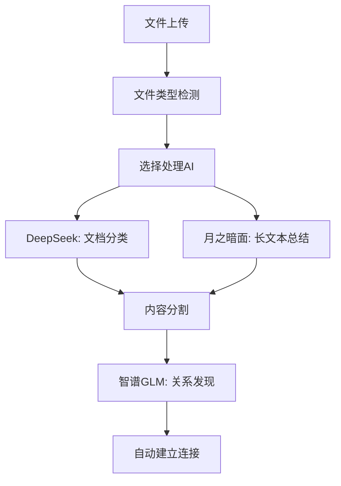
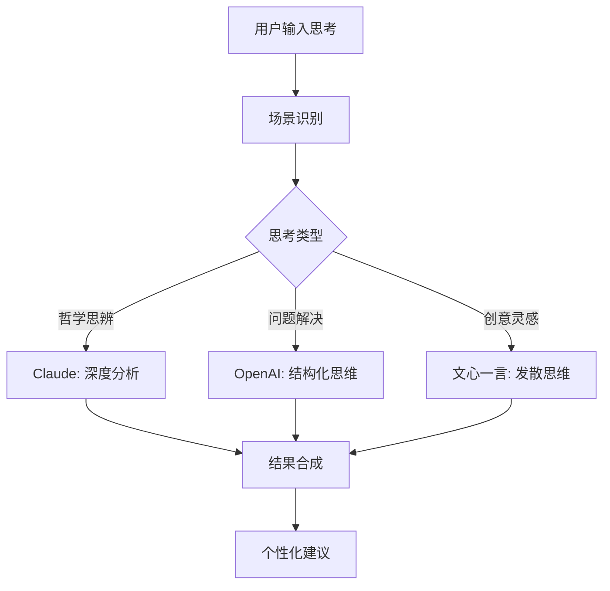
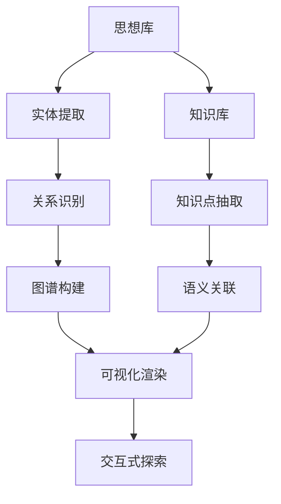

# 🧠 ThinkMate 智能AI编排系统设计方案

## 🎯 乔布斯级别产品愿景

**"让AI成为真正的思维伙伴，每个场景都有最适合的AI助手"**

### 核心理念
- **场景感知**：AI自动感知任务类型，选择最优提供商
- **智能编排**：多AI协同工作，各司其职
- **无缝体验**：用户无需思考AI选择，专注思考本身
- **持续学习**：系统根据效果自动优化AI选择策略

---

## 🏗️ 系统架构设计

### 1. AI智能调度引擎 (AI Orchestrator)

```typescript
interface AIOrchestrator {
  // 场景检测
  detectScenario(content: string, context: ThinkingContext): AIScenario
  
  // 智能选择AI
  selectOptimalAI(scenario: AIScenario): AIProvider[]
  
  // 任务分解与分配
  orchestrateTask(task: ThinkingTask): Promise<OrchestrationResult>
  
  // 结果合成
  synthesizeResults(results: AIResult[]): CombinedInsight
}
```

### 2. 场景分类系统

```typescript
enum AIScenario {
  // 快速任务 - 使用高效AI
  QUICK_CLASSIFICATION = 'quick_classification',    // DeepSeek
  CONTENT_SUMMARIZATION = 'content_summarization',  // 月之暗面
  FILE_PROCESSING = 'file_processing',              // DeepSeek
  
  // 深度分析 - 使用顶级AI  
  DEEP_INSIGHT = 'deep_insight',                    // OpenAI GPT-4
  PHILOSOPHICAL_THINKING = 'philosophical',         // Claude
  COMPLEX_REASONING = 'complex_reasoning',          // OpenAI GPT-4
  
  // 专项任务 - 使用专门AI
  SEARCH_OPTIMIZATION = 'search_optimization',      // Gemini
  KNOWLEDGE_LINKING = 'knowledge_linking',          // 智谱GLM
  CREATIVE_INSPIRATION = 'creative_inspiration',    // 文心一言
  
  // 自动化任务 - 使用可靠AI
  AUTO_TAGGING = 'auto_tagging',                    // DeepSeek
  CONTENT_CATEGORIZATION = 'categorization',        // 通义千问
  RELATIONSHIP_DETECTION = 'relationship_detection' // 智谱GLM
}
```

### 3. 智能思维链接引擎

```typescript
interface ThoughtLinkingEngine {
  // 自动发现关联
  discoverConnections(thoughts: Thought[]): Promise<Connection[]>
  
  // 实时建议链接
  suggestConnections(currentThought: Thought): Promise<ConnectionSuggestion[]>
  
  // 知识图谱构建
  buildKnowledgeGraph(thoughts: Thought[], knowledge: KnowledgeItem[]): Promise<KnowledgeGraph>
  
  // 智能问答
  answerBasedOnConnections(question: string): Promise<ConnectedAnswer>
}
```

---

## 🎨 用户体验设计

### 1. 透明的AI选择
- 用户无需手动选择AI，系统自动决策
- 显示当前使用的AI和原因
- 允许高级用户手动覆盖选择

### 2. 实时AI工作状态
```typescript
interface AIWorkStatus {
  scenario: AIScenario
  selectedAIs: AIProvider[]
  processingSteps: ProcessingStep[]
  estimatedTime: number
  confidence: number
}
```

### 3. 结果呈现策略
- **快速反馈**：简单任务立即显示结果
- **渐进呈现**：复杂分析逐步显示进度
- **多维展示**：不同AI的见解分层展示

---

## 🔄 核心工作流程

### 1. 智能文件处理流程



### 2. 深度思考增强流程



### 3. 知识图谱构建流程



---

## 🚀 技术实现方案

### 1. AI编排核心引擎

```typescript
// src/lib/orchestrator/AIOrchestrator.ts
export class AIOrchestrator {
  private scenarioDetector: ScenarioDetector
  private aiSelector: AISelector
  private taskDistributor: TaskDistributor
  private resultSynthesizer: ResultSynthesizer
  
  async processThought(thought: Thought): Promise<EnhancedResult> {
    // 1. 检测场景
    const scenario = await this.scenarioDetector.detect(thought)
    
    // 2. 选择最优AI组合
    const aiCombo = this.aiSelector.selectOptimal(scenario)
    
    // 3. 分配任务
    const tasks = this.taskDistributor.distribute(thought, aiCombo)
    
    // 4. 并行执行
    const results = await Promise.all(tasks)
    
    // 5. 结果合成
    return this.resultSynthesizer.combine(results)
  }
}
```

### 2. 场景检测算法

```typescript
// src/lib/orchestrator/ScenarioDetector.ts
export class ScenarioDetector {
  private patterns = {
    quickClassification: [
      /简单|分类|整理|标签/,
      content => content.length < 100
    ],
    deepInsight: [
      /为什么|思考|分析|理解|洞察/,
      content => this.hasQuestionPattern(content)
    ],
    creativeThing: [
      /创意|想法|灵感|设计|构思/,
      content => this.hasCreativeWords(content)
    ]
  }
  
  async detect(thought: Thought): Promise<AIScenario> {
    // 使用轻量级本地算法 + AI辅助判断
    const localDetection = this.detectLocally(thought.content)
    const aiDetection = await this.aiAssist(thought.content)
    
    return this.combineDetections(localDetection, aiDetection)
  }
}
```

### 3. 智能链接引擎

```typescript
// src/lib/linking/ThoughtLinkingEngine.ts
export class ThoughtLinkingEngine {
  async discoverConnections(thoughts: Thought[]): Promise<Connection[]> {
    // 使用智谱GLM进行语义关联分析
    const semanticConnections = await this.semanticAnalysis(thoughts)
    
    // 使用Gemini进行搜索优化
    const searchConnections = await this.searchBasedLinking(thoughts)
    
    // 合并和去重
    return this.mergeConnections(semanticConnections, searchConnections)
  }
  
  private async semanticAnalysis(thoughts: Thought[]): Promise<Connection[]> {
    const zhipuProvider = new ZhipuProvider(config)
    
    for (const thought of thoughts) {
      const relatedThoughts = await zhipuProvider.findRelatedThoughts(
        thought, 
        thoughts.filter(t => t.id !== thought.id)
      )
      
      // 建立语义连接
      yield* this.createSemanticConnections(thought, relatedThoughts)
    }
  }
}
```

### 4. 知识图谱可视化

```typescript
// src/components/features/KnowledgeGraph.tsx
export function KnowledgeGraph() {
  const [graphData, setGraphData] = useState<GraphData>()
  const [selectedNode, setSelectedNode] = useState<GraphNode>()
  
  return (
    <div className="h-full w-full relative">
      {/* 3D知识图谱 */}
      <SVGCanvas 
        data={graphData}
        onNodeClick={setSelectedNode}
        onNodeHover={showNodeDetails}
        layout="force-directed"
        interactive={true}
      />
      
      {/* 侧边信息面板 */}
      <GraphInfoPanel node={selectedNode} />
      
      {/* 图谱控制面板 */}
      <GraphControls />
    </div>
  )
}
```

---

## 🎯 分阶段实施计划

### Phase 1: AI智能编排基础 (第1周)
1. **创建AI编排核心架构**
   - AIOrchestrator基础类
   - ScenarioDetector场景检测
   - AISelector智能选择
   - 基础的场景-AI映射

2. **实现3个核心场景**
   - 快速分类 (DeepSeek)
   - 深度分析 (OpenAI)
   - 搜索优化 (Gemini)

### Phase 2: 思维链接AI引擎 (第2周)
1. **自动关联发现**
   - ThoughtLinkingEngine
   - 语义相似度算法
   - 实时连接建议

2. **智能推荐系统**
   - 基于历史的连接学习
   - 个性化推荐算法
   - 连接质量评分

### Phase 3: 知识图谱可视化 (第3周)
1. **图谱数据结构**
   - Graph数据模型
   - 节点和边的类型系统
   - 图谱算法优化

2. **交互式可视化**
   - SVG/Canvas渲染引擎
   - 力导向布局算法
   - 缩放、拖拽、搜索

### Phase 4: 界面设计革新 (第4周)
1. **左侧导航重设计**
   - AI状态实时显示
   - 场景切换快捷方式
   - 个性化配置面板

2. **设置界面优化**
   - AI选择策略配置
   - 性能监控面板
   - 高级用户选项

---

## 🔧 可扩展性设计

### 1. 插件化AI提供商
```typescript
interface AIProviderPlugin {
  name: string
  capabilities: AICapability[]
  scenarios: AIScenario[]
  priority: number
  
  analyze(content: string): Promise<AIResult>
  configure(config: ProviderConfig): void
}
```

### 2. 可配置场景规则
```typescript
interface ScenarioRule {
  name: string
  patterns: Pattern[]
  aiStrategy: AIStrategy
  userCustomizable: boolean
}
```

### 3. 开放式扩展接口
```typescript
interface ThinkMateExtension {
  id: string
  hooks: ExtensionHooks
  ui: ExtensionUI
  ai: ExtensionAI
}
```

---

## 📊 成功指标

### 用户体验指标
- **AI选择准确率** > 90%
- **响应时间** < 3秒 (简单) / < 10秒 (复杂)
- **用户满意度** > 4.5/5

### 技术性能指标
- **系统可用率** > 99.5%
- **并发AI调用** 支持 >100/秒
- **错误恢复时间** < 1秒

### 功能完成度指标
- **场景覆盖率** 100% (10个核心场景)
- **AI提供商集成** 100% (10个提供商)
- **功能模块完成** 100% (5个核心模块)

---

## 🎉 最终愿景

创建一个真正的"AI思维操作系统"，让每个用户都能拥有一个:
- **🧠 智能的思维伙伴** - 自动理解和增强思考
- **🔗 连接的知识网络** - 发现隐藏的关联和洞察  
- **🎯 个性化的AI助手** - 适应个人思维模式和偏好
- **🚀 可扩展的平台** - 支持未来AI技术的无缝集成

这将是一个革命性的思维工具，真正实现"AI + 人类智慧"的完美融合！

---

*设计思维来源：乔布斯的"简洁至上"、"用户至上"、"技术与人文的交汇点"*